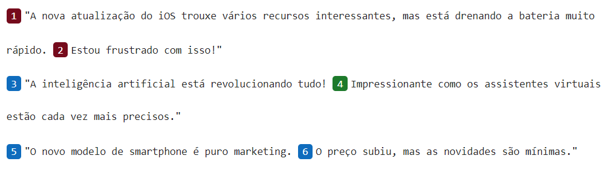
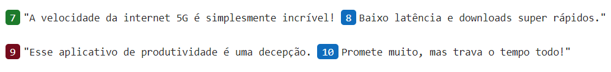
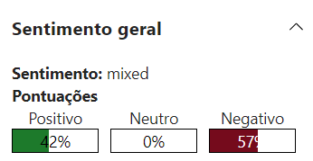
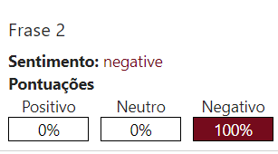
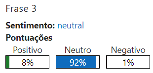
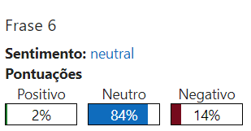
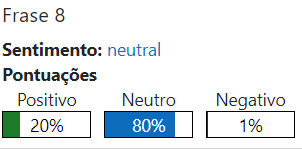
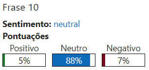

# Análise de Sentimentos com IA

Fiz uma análise de sentimentos utilizando o serviço de IA e o Language Studio da Azure. Separei
meu teste em alguns passos, a fim de consolidar o conhecimento e ganhar mais experiência com a
ferramenta.

---

## 📌 Entender os Possíveis Casos de Uso

Buscando por possíveis casos de uso, encontrei vários, como:

- 📊 **Usar IA para detectar emoções**
- 🎧 **Fornecer melhor experiência de suporte**
- 💡 **Entender opiniões sobre características de produtos ou serviços**
- 📈 **Revelar e/ou prever tendências de mercado**
- 🏢 **Monitorar e entender a percepção de uma marca**
- 📋 **Pesquisas de satisfação**

🔍 Escolhi analisar posts com temas relevantes da atualidade para identificar tendências.

---

## 🔎 Buscar por Material para Realizar Testes

Encontrei alguns posts sobre tecnologia que continham opiniões sobre diversos temas.

---

## 📊 Interpretar os Resultados

### 🖥️ Tecnologia

#### 🔹 Frases e suas Classificações Gerais

#### 🔹 Sentimento Geral dos Dados Fornecidos

#### 📌 Análise de Frases Específicas

- **Frase 2**: 
  - 
  - A frase expressa uma opinião negativa sobre a atualização do iOS, sendo corretamente classificada pela IA.

- **Frase 3**: 
  - 
  - Apesar de parecer positiva, a IA classificou como neutra. A opinião do usuário está mais clara na frase 4.

- **Frase 6**: 
  - 
  - Discordo da classificação da IA. Apesar de neutra, a frase expressa frustração do escritor. Isso reforça a importância da revisão humana.

- **Frase 8**: 
  - 
  - Caso semelhante ao da frase 6, demonstrando a necessidade de ajustes no modelo.

- **Frase 10**: 
  - 
  - Novamente, a classificação neutra pode não representar corretamente o sentimento do usuário.

---

## 🏁 Conclusão

A análise automática de sentimentos é uma ferramenta poderosa, mas pode apresentar inconsistências. A revisão humana continua sendo essencial para garantir uma interpretação precisa dos sentimentos expressos nas frases.
